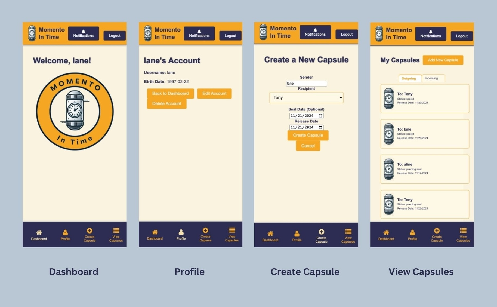
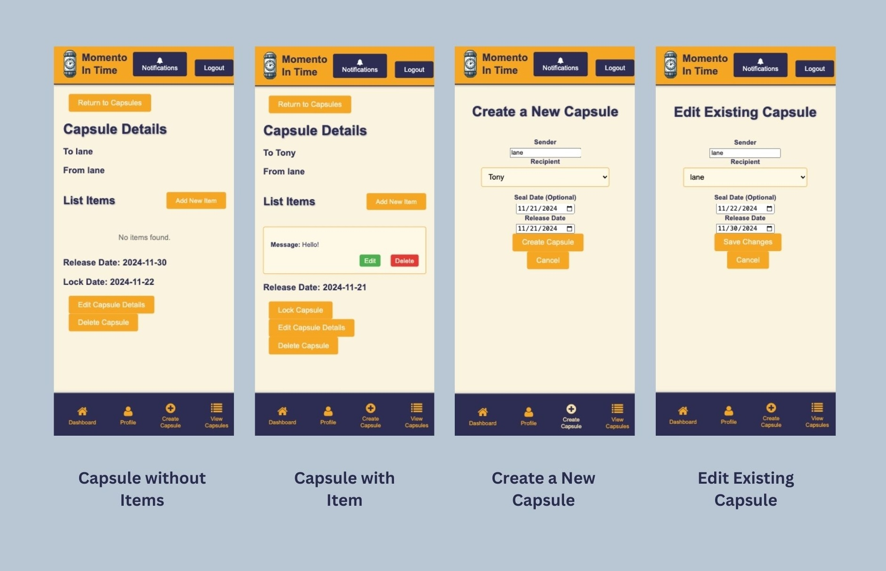
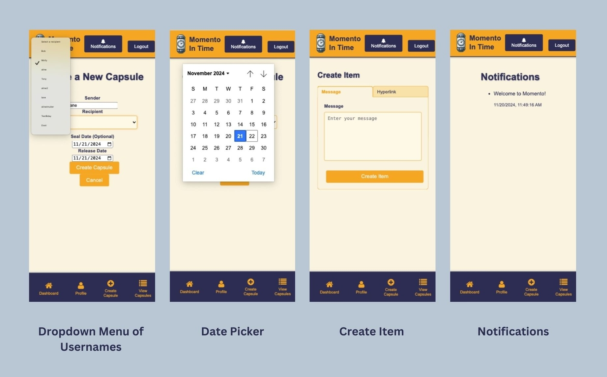
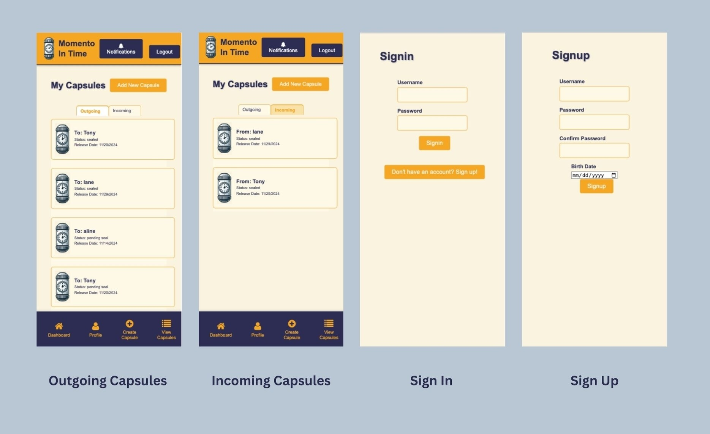

README.md

# Momento - Front End

[Momento](https://momentointime.netlify.app “Directing to application site”)

### Contributors: Aline Muller, Delaney Wells, Molly Parente | 2024

## Big Picture

Momento was created to mimic the functions of a time capsule, where users can create, lock, and release virtual capsules containing memories, messages, or items in other formats. Users can send capsules as a message to their future selves, a gift to a loved one, or a shared memory for a group. With potential for expansion and feature development, we created Momento with the goal of making it easy and fun to send moments through time.

## Key Features

-  Create Capsules: Create capsules by setting a recipient (yourself or another user) and schedule a release date in the future.
-  Add Items: Compose messages, little notes, even add hyperlinks to your capsule.
-  Lock Capsules: Securely seal your capsules, which will block them from future editing and keep their contents hidden from the recipient until they can be opened on the release date.
-  Role-Based Visibility:
-  Sender View: Senders can always view the items inside a capsule they’ve created unless they are also the recipient, in which case the items become hidden until release date.
-  Recipient View: Receipients can view incoming capsules as “sealed” once locked by sender. However, items remain hidden until release date.
Automatic Status Updates: Capsules automatically update their status to “sealed”, “pending seal”, or “released” based on user actions and release date.
-  User Options: Users have the option to pre-declare a seal date when creating or editing their capsule, making it easier to coordinate a group capsule for the future of the app.

## Technologies Used

-  Frontend: React with React Router for navigation
-  Backend: Node.js and Express for API management
-  Database: MongoDB for storing data from all 3 models
-  Styling: CSS

## How it Works

-  Sign In/Sign Up: Start by creating your profile
-  Dashboard: Navigate the site and view your notifications
-  Create a Capsule: Add details, items, and lock your capsule when ready.
-  Wait for the Release Date: Your capsule will be unlocked and your recipient can open to see its contents!

## User Stories Implemented

-  As a new user, I want to sign up with my email and create a secure password so that I can have a personalized account to access my capsules.
-  As a returning user, I want to sign in with my credentials so that I can securely access my account and stored capsules.
-  AAU, I want to log out securely so that my account and capsules remain private.
-  As a signed-in user, I want to create a new time capsule by adding a message and/or files so that I can preserve memories or thoughts to open in the future.
-  AAU, I want to set a release date for my capsule so that it remains locked until a specific time.
-  AAU, I want to view a list of all my time capsules so that I can keep track of what I’ve created and when they’ll open.
-  AAU, I want to see a status (locked or available to open) next to each capsule so that I know which ones are ready to be opened.
-  AAU, I want to delete a capsule so that I can manage or remove messages I no longer want to keep.
-  AAU, I want to open a capsule and view its contents (message and files) once the release date has passed so that I can experience the memory I saved.
-  AAU, I want an easy-to-navigate interface so that I can intuitively create, view and manage my capsules.
  

## Stretch Goals MET

1.  Filtered views of Incoming and Outgoing capsules.
2.  User option to pre-declare a seal date when creating or editing their capsule, making it easier to coordinate a group capsule for the future of the app.
3.  Drop down menu of users to choose from by username.
4.  Have a nav bar mobile-friendly so you can click on “view my capsules” and other links at any point.
5.  Options for user to input birthday
6.  View profile function.

## Stretch Goals Not Met...Yet?

1.  Confirmation messages for every relevant function when user completes an action so that they know their actions were successful.
2.  Recipient will be notified when the capsule unlocks.
3.  Group capsule capabilities.
4.  The option to enter another person’s email when creating a capsule so that users can gift the capsule to someone else.
5.  An “are you sure” double-checking system for pressing seal/lock button.

### Citations

[Font Awesome](https://fontawesome.com/search?o=r&s=solid&ip=sharp-duotone)
Used for icon library

#### Link to Back End GitHub Repository:

[Momento Back End](https://github.com/lanewells/momento “Directing to GitHub”)
