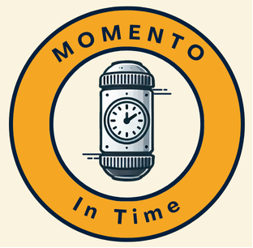

# Momento - Front End

[Momento](https://momentointime.netlify.app "Directing to application site")

### Contributors: Aline Muller, Delaney Wells, Molly Parente | 2024

## Big Picture

Momento was created to mimic the functions of a time capsule, where users can create, lock, and release virtual capsules containing memories, messages, or items in other formats. Users can send capsules as a message to their future selves, a gift to a loved one, or a shared memory for a group. With potential for expansion and feature development, we created Momento with the goal of making it easy and fun to send moments through time.

## Key Features

- Create Capsules: Create capsules by setting a recipient (yourself or another user) and schedule a release date in the future.
- Add Items: Compose messages, little notes, even add hyperlinks to your capsule.
- Lock Capsules: Securely seal your capsules, which will block them from future editing and keep their contents hidden from the recipient until they can be opened on the release date.
- Role-Based Visibility:
  - Sender View: Senders can always view the items inside a capsule they've created unless they are also the recipient, in which case the items become hidden until release date.
  - Recipient View: Receipients can view incoming capsules as "sealed" once locked by sender. However, items remain hidden until release date.
- Automatic Status Updates: Capsules automatically update their status to "sealed", "pending seal", or "released" based on user actions and release date.
- User Options: Users have the option to pre-declare a seal date when creating or editing their capsule, making it easier to coordinate a group capsule for the future of the app.

## Technologies Used

- Frontend: React with React Router for navigation
- Backend: Node.js and Express for API management
- Database: MongoDB for storing data from all 3 models
- Styling: CSS

## How it Works

1.  Sign In/Sign Up: Start by creating your profile
2.  Dashboard: Navigate the site and view your notifications
3.  Create a Capsule: Add details, items, and lock your capsule when ready.
4.  Wait for the Release Date: Your capsule will be unlocked and your recipient can open to see its contents!

## Stretch Goals MET

## Stretch Goals Not Met...Yet?

Release Date: Your recipient will be notified when the capsule unlocks!
Group capsule
A lot of other stuff probably

### Citations

#### Link to Back End GitHub Repository:

[Momento Back End](https://github.com/lanewells/momento "Directing to GitHub")
